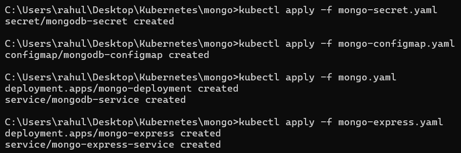
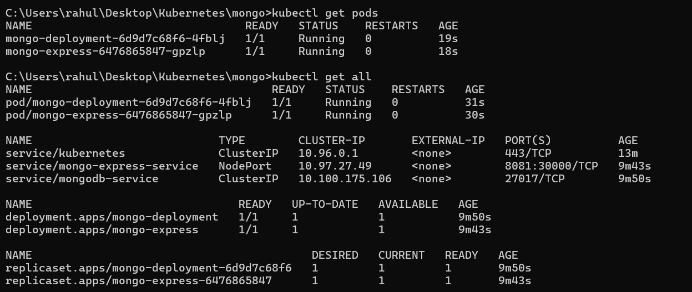
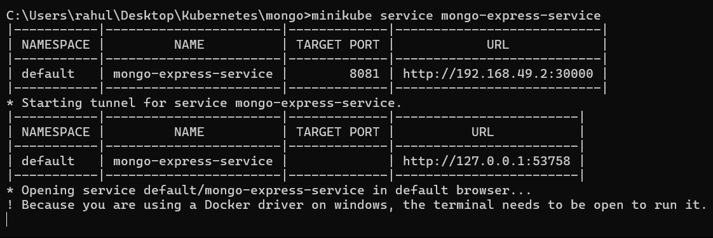
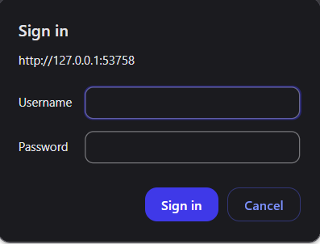
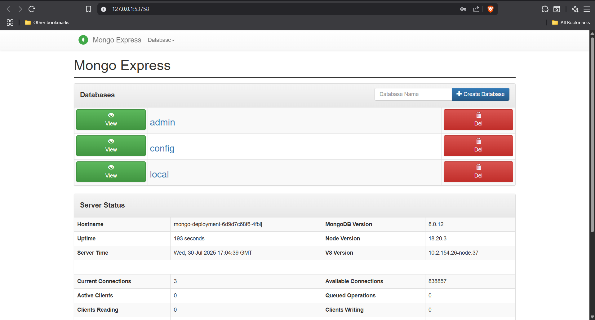

## 🚀 Prerequisites

- [Docker Desktop](https://www.docker.com/products/docker-desktop) (running)
- [Minikube](https://minikube.sigs.k8s.io/docs/start/) installed
- [kubectl](https://kubernetes.io/docs/tasks/tools/) installed

---

## ⚙️ Setup Instructions

### 1. Start Minikube

```bash
minikube start --driver=docker
```
---





